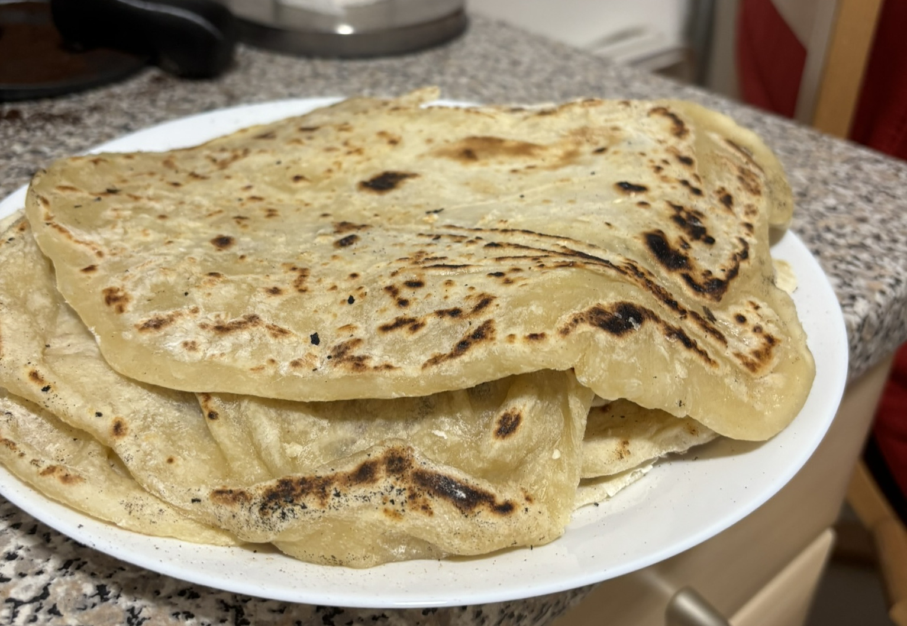

# Naan

## Ingredients

### For 6 pieces

- **1** Small spoon of dried yeast
- **1/4** Small spoon of sugar
- **100ml** Warm milk (not hot!) 
- **250g** Wheat flour
- **100g** Yoghurt
- **1/2** Small spoon of salt
- **1/2** Small spoon of baking powder
- Butter

## Cooking

### Preparing the dough

- Combine the yeast and the warm milk and stir to ensure the yeast does not form any clumbs.
- Put the flour into a separate bowl and form a hollow in the center of the wheat.
- Pour the yeast-milk mixture into the hollow and mix it all together.
- The mixture will form a dough.
- Let the dough rest in a warm spot for at least 10 minutes.

### Finishing the dough

- After the dough has rested, add the yoghurt, salt, and the baking powder to the mixture and knead for at least 5 minutes
- Cover the dough and let it rest for at least 1h in a warm place (if you give the dough more time, it will become even fluffier)

### Finishing the naan

- Split the dough into 6 equally sized pieces.
- Create little spheres from the pieces.
- Using a rolling pin or your hands, flatten the spheres and form little pancakes.
- In the meantime heat a pan until it is very hot.
- Put the formed naan breads into the pan.
- If the dough starts to form bubbles, turn the naan around
- If the naan is slightly brown on both sides, remove the bread from the pan and serve.

### Topping

You can add butter to the naan while serving to enhance the simple breads. I can recommend garlic butter, as it fits perfectly with the breads.